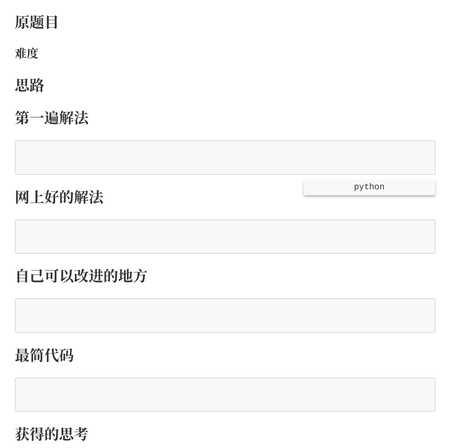

# python_toy
自己写的 Python 小脚本

### 利用 Python 自动生成 LeetCode 刷题笔记

[文章](https://purenjie.github.io/2019/04/13/%E5%88%A9%E7%94%A8-Python-%E8%87%AA%E5%8A%A8%E7%94%9F%E6%88%90-leetcode-%E5%88%B7%E9%A2%98%E7%AC%94%E8%AE%B0/)

[代码](https://github.com/purenjie/python_toy/blob/master/leetcode_note.py)