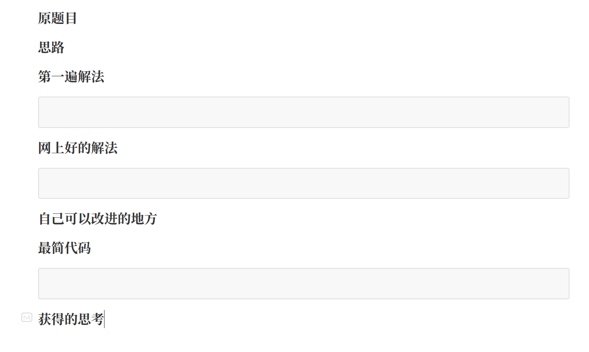

# python_toy
### 利用 Python 自动生成 LeetCode 刷题笔记

[文章](https://purenjie.github.io/2019/04/13/%E5%88%A9%E7%94%A8-Python-%E8%87%AA%E5%8A%A8%E7%94%9F%E6%88%90-leetcode-%E5%88%B7%E9%A2%98%E7%AC%94%E8%AE%B0/)

[代码](https://github.com/purenjie/python_toy/blob/master/leetcode_note.py)

### 利用 Python 得到未来七天天气预报

通过爬取中国天气网上的数据，解析天气情况和生活建议，在终端显示未来几天的天气和建议

[文章](https://purenjie.github.io/2019/04/14/%E5%88%A9%E7%94%A8-Python-%E5%BE%97%E5%88%B0%E6%9C%AA%E6%9D%A5%E4%B8%83%E5%A4%A9%E5%A4%A9%E6%B0%94%E9%A2%84%E6%8A%A5/)

[代码](https://github.com/purenjie/python_toy/blob/master/weather_predict.py)